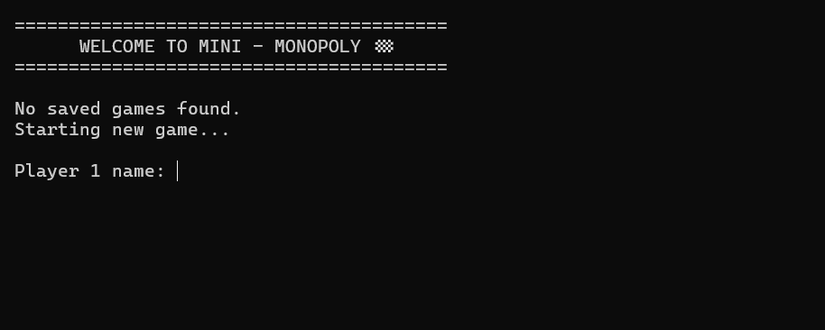
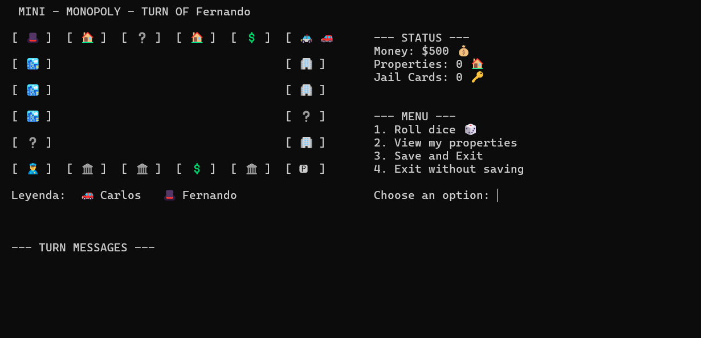
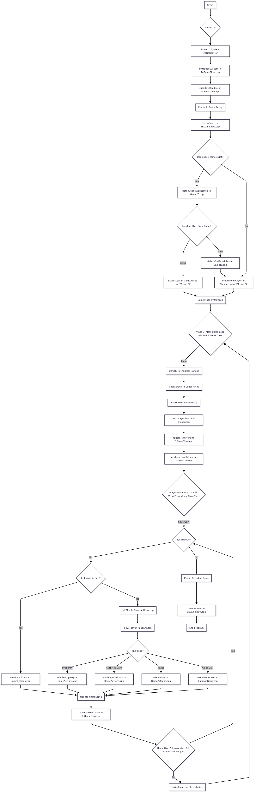

# C++ PROJECT - Mini - Monopoly 🎲

## Description of the project

A lightweight, text-based Monopoly-style game for two players, built with C++ and running in a modern console environment. This project was developed as a comprehensive exercise in fundamental programming concepts.

**Project Overview**
Minimonopoly is a complete, simplified Monopoly experience featuring property acquisition, rent, surprise cards, jail, and a dynamic text-based user interface. The primary goal was to build a robust, modular, and well-structured application from the ground up.

## Core Concepts & Technologies Used:

**Procedural Programming:** The project is built on a modular structure with a clear separation of concerns.

**Conditional Logic:** Extensive use of `if-else if` chains and `switch` statements to manage game rules and menu choices.

**Loops:** for loops are used for iteration over game board tiles and properties, `while & do-while` loops manage the main game flow and user input validation.

**Data Structures:** The project utilizes fundamental structures like `arrays` for board layout and player properties, and `matrices` (2D arrays) to define and manage property sets.

**File I/O:** A complete save/load system is implemented using `text files (.txt)` to ensure game state persistence.

## TEAM

- **Team Name:** Internautas

### Team members

1. **Full name:** [Carlos Fernando Martinez Mogollon]  
   **ID:** 00181425

2. **Full name:** [Axel Alessandro Rivas Moran]
   **ID:** 001153925

3. **FUll name:** [Rodrigo Ernesto Rivas Marroquin]  
   **ID:** 0036224

4. **FUll name:** [Sofía Nicole Rodríguez Campos]  
   **ID:** 00175525

## Installation and Execution Guide

This guide provides the necessary steps to set up a development environment, compile the source code, and run the game.

**Step 1: Install Required Tools**
You will need a C++ compiler (g++), a code editor (VS Code is recommended), and Git (optional).

**Visual Studio Code:** The recommended code editor. Download it from the official website:

https://code.visualstudio.com/

**C++ Compiler (for Windows):** The easiest way to get the g++ compiler on Windows is by installing MSYS2.

Go to https://www.msys2.org/ and follow their installation guide.

After installing, open the MSYS2 UCRT64 terminal from your Start Menu.

In that terminal, run this command to install the compiler suite:

pacman -S mingw-w64-ucrt-x86_64-gcc

**Windows Terminal (Recommended)**: For the best visual experience with emojis, run the final game in the modern Windows Terminal, which you can get for free from the Microsoft Store.

**Step 2: Get the Project Code**
Open a terminal (like Git Bash or the MSYS2 UCRT64 terminal).

Navigate to a directory where you want to save the project (e.g., cd Desktop).

Clone the repository using this command:

git clone https://github.com/FDP-01-2025/project-internautas.git

Navigate into the new project folder: cd project-internautas

Open the folder in Visual Studio Code.

**Step 3: Compile and Run**
In Visual Studio Code, open the integrated terminal (View -> Terminal or by pressing Ctrl+` ).

Paste the following command into the terminal and press Enter. This will compile all source files and create the final executable.

` g++ MAIN/main.cpp src/Player.cpp src/Board.cpp src/GameIO.cpp src/GameActions.cpp src/Console.cpp src/Validation.cpp src/InGameFlow.cpp -o minimonopoly -Isrc   `

If the compilation is successful, run the game by typing the following command:

`    ./minimonopoly       `

After compiling and running, you should see the following window:

## User Manual

This guide explains the rules, objectives, and strategies for playing Minimopoly.

**Game Objective**
The goal of Minimopoly is to become the wealthiest player and drive your opponent into bankruptcy. You do this by strategically buying properties, collecting sets to increase their value, and charging your opponent rent.

**Starting a Game**
When you launch the game, you will be asked if you want to load a previously saved game or start a new one. After making your choice, each of the two players will enter their name.

**Important: Player names must be entered without spaces (e.g., "Carlos" instead of "Carlos Fernando").**

Each player starts the game with:

$1500 in cash. (Depending on the configurations)

Their piece on the "GO!" (🏁) tile.

## Core Rules

The game follows a simplified ruleset for a faster and more dynamic experience:

The game is designed for 2 players.

The board has a total of 20 tiles.

Movement is determined by a single six-sided die.

There are 11 purchasable properties in total on the board.

Each time you complete a lap and pass the "GO!" tile, you collect a $200 bonus. (Depending on the configurations)

Landing on a "Surprise Card" (❔) tile triggers a random event that can help or hinder you.

If you land in Jail, you will lose 2 turns.

## The Core Strategy:

**Property Sets**
This is the most important part of the game's strategy.

The 11 properties are grouped into 4 distinct sets. You can easily identify a set because all its properties share the same emoji icon (e.g., all 🏠 properties form one set).

The Golden Rule: If you manage to buy all properties of the same set, you achieve a "monopoly". From that point on, the

rent for all properties in that set is DOUBLED for any opponent who lands on them.

Strategy Tip: The main goal is not just to buy random properties, but to buy the right properties to complete a set. Preventing your opponent from completing their sets is just as important!

**How to Win**
There are two ways for the game to end and for a winner to be declared:

By Bankruptcy: If a player has to pay a debt (rent or tax) and their money drops below -$500, they go bankrupt. The other player wins immediately.

By Domination: The game also ends when all 11 properties on the board have been purchased. At this point, the winner is determined by a two-step process:

First, the player with the most properties wins.

If tied on properties, the player with the most money wins.

## Developer's Documentation

Project Architecture & Module Explanation

The project is heavily modularized to separate concerns, making the code clean and maintainable.

**Constants.h**

Purpose: This file is the game's central "control panel" or "rulebook". It holds all global constants, including starting money, property prices, rents, visual symbols for the board, and the crucial property set matrix. To balance or re-theme the game, this is the only file you need to edit.

**Player Module (.h, .cpp)**

Purpose: This module defines the Player data structure, which is a blueprint holding all information for a single player (name, money, position, owned properties, icon, etc.). It also provides utility functions like createNewPlayer to initialize a player with default values.

**Console Module (.h, .cpp)**

Purpose: A low-level utility that abstracts away OS-specific code for manipulating the console. It uses conditional compilation (#ifdef \_WIN32) to provide universal functions like clearScreen() and printAt(x, y, text), enabling a stable text-based UI on both Windows and Linux/macOS.

**Validation Module (.h, .cpp)**

Purpose: A dedicated utility for robust user input. It prevents crashes from bad input (e.g., typing letters instead of numbers) and centralizes validation logic in functions like getValidInput and getYesNoInput to avoid code duplication.

**Board Module (.h, .cpp)**

Purpose: The game's visual architect. It's responsible for rendering the game board and player icons at precise coordinates using the Console module. Its getCoords helper function translates the 1D board position into 2D coordinates, which is key to its perfect alignment.

**GameActions Module (.h, .cpp)**

Purpose: The "rules engine". It implements the logic for what happens on each tile. It defines the central GameState struct, and its functions handle buying property, charging rent (including multiplied rent for sets via ownsFullSet), processing surprise cards, taxes, and jail mechanics.

**GameIO Module (.h, .cpp)**

Purpose: The game's archivist. It handles all file input/output for saving and loading game progress. It uses a master savegame.txt file and individual player files, and the loadPlayer function is written robustly to prevent data corruption.

**InGameFlow Module (.h, .cpp)**

Purpose: The game's high-level director. This module contains the main sequence of game events (setup, UI drawing, turn menu, turn actions), which keeps the main.cpp file extremely clean and readable.

**main.cpp**

Purpose: The program's entry point. Its only job is to initialize the system and run the main game loop by calling the high-level functions from the GameFlow module in the correct order.

**Game Flowchart**

**Without further ado, enjoy the game!**
